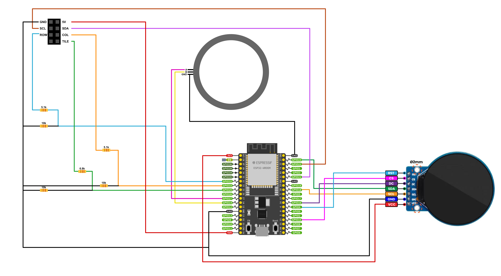

# Wiring
The Proxies and the code are built around the ESP32-WROOM-32U board.

# Instructions
To upload the code, set the Folder of the Proxy you want to upload as Sketchbook location in the Arduino IDE (*File -> Preferences -> Sketchbook location*) and click upload.